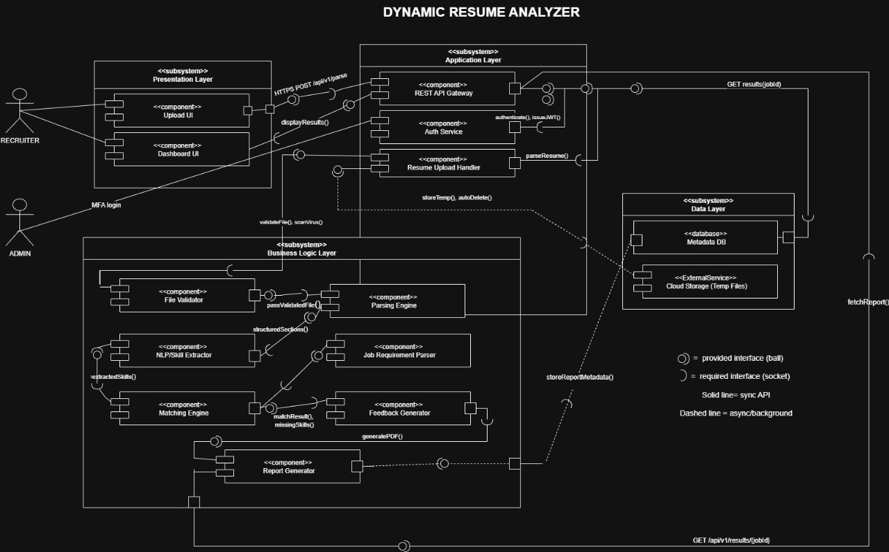

# Dynamic Resume Analyzer

**Project ID:** P47  
**Course:** UE23CS341A  
**Academic Year:** 2025  
**Semester:** 5th Semester  
**Campus:** RR  
**Branch:** CSE  
**Section:** L  
**Team Name:** CommitAndChill

## 📋 Project Description

A service that parses uploaded resumes (text), identifies sections (e.g., skills, education), and flags missing common elements. The project uses regex-based parsing, section-mapping logic, and feedback generation.

This repository contains the source code and documentation for the Dynamic Resume Analyzer project, developed as part of the UE23CS341A course at PES University, Bengaluru.

## 🧑‍💻 Development Team (CommitAndChill)

- [@VineetSharma05](https://github.com/VineetSharma05) - Scrum Master
- [@vrishank-na](https://github.com/vrishank-na) - Developer Team
- [@vishwambharaRH](https://github.com/vishwambharaRH) - Developer Team
- [@prerana2005](https://github.com/prerana2005) - Developer Team

## 👨‍🏫 Teaching Assistant

- [@RakshithKakunje9](https://github.com/RakshithKakunje9)
- [@Thaman-N](https://github.com/Thaman-N)
- [@v-s-v-i-s-h-w-a-s](https://github.com/v-s-v-i-s-h-w-a-s)

## 👨‍⚖️ Faculty Supervisor

- [@rbanginwar](https://github.com/rbanginwar)


## Getting Started

### Installation
1. Clone the repository
   ```bash
   git clone https://github.com/pestechnology/PESU_RR_CSE_L_P47_Dynamic_Resume_Analyzer_CommitAndChill.git
   cd PESU_RR_CSE_L_P47_Dynamic_Resume_Analyzer_CommitAndChill
   ```

2. Install dependencies
   ```bash
   pip install -r requirements.txt
   ```

3. Run the application
   ```bash
   # for frontend
   cd frontend
   npm install 
   npm run dev
   ```
   ```bash
   # for backend
   uvicorn src.main:app --reload
   ```


## 📁 Project Structure

```
PESU_RR_CSE_L_P47_Dynamic_Resume_Analyzer_CommitAndChill/
├── src/                 # Source code
├── docs/               # Documentation
├── tests/              # Test files
├── .github/            # GitHub workflows and templates
├── README.md          # This file
└── ...
```

## 🛠️ Development Guidelines

### Branching Strategy
- `main`: Production-ready code
- `develop`: Development branch
- `feature/*`: Feature branches
- `bugfix/*`: Bug fix branches

### Commit Messages
Follow conventional commit format:
- `feat:` New features
- `fix:` Bug fixes
- `docs:` Documentation changes
- `style:` Code style changes
- `refactor:` Code refactoring
- `test:` Test-related changes

### Code Review Process
1. Create feature branch from `develop`
2. Make changes and commit
3. Create Pull Request to `develop`
4. Request review from team members
5. Merge after approval

## 📚 Documentation

- [API Documentation](docs/api.md)
- [User Guide](docs/user-guide.md)
- [Developer Guide](docs/developer-guide.md)

## 🧪 Testing

```bash
# Run tests
npm test

# Run tests with coverage
npm run test:coverage
```

## Architecture UML


# CI/CD Pipeline Documentation & Reliability

Our project uses **GitHub Actions** to provide a complete CI/CD workflow for automated testing, quality checks, security scanning, and deployment packaging.

The pipeline runs automatically on:

- **Every push** to `main` or `develop`
- **Every pull request** targeting `main` or `develop`
- **Manual dispatch via GitHub Actions**

---

## CI/CD Pipeline Overview

The CI/CD workflow is divided into **six major stages**, each with strict quality gates and automated validation steps.

---

## 1. Build Stage

**Purpose:**  
Prepare and build both backend and frontend code.

**Key Steps:**
- Checkout the repository
- Install Python 3.10 + backend dependencies
- Install Node.js 20 + frontend dependencies
- Build frontend (Vite/React)
- Upload build output as artifact (`frontend-build`)

**Tools Used:**  
Python, pip, Node.js, npm

---

## 2. Test Stage (Unit, Integration, System)

**Purpose:**  
Ensure application correctness with automated testing.

**Actions Performed:**
- Execute backend tests using `pytest`
- Run unit, integration, and system tests
- Enforce minimum coverage of **75%**
- Test frontend (if tests exist under `/frontend/__tests__/`)
- Validate Grammar Engine & Action Verb Engine

**Tools Used:**
- `pytest`, `pytest-cov`, `pytest-html`
- `spacy`
- `npm test`

**Quality Gates:**
- ✔ All tests must pass  
- ✔ Test coverage ≥ **75%**

---

## 3. Coverage Stage

**Purpose:**  
Generate complete code coverage reports.

**Actions Performed:**
- Run pytest with branch coverage
- Generate HTML coverage folder (`htmlcov/`)
- Fail pipeline if coverage < **75%**

**Tool:** `pytest-cov`

---

## 4. Lint Stage (Static Analysis)

Ensures consistent coding style and readability.

### Python Lint:
- Runs `pylint` on `/src/`
- Extracts score automatically
- Enforces minimum score of **7.5/10**

### JavaScript Lint:
- Installs and runs ESLint through `npm run lint`

**Quality Gates:**
- ✔ Python lint score ≥ **7.5/10**
- ✔ No ESLint errors

---

## 5. Security Scan Stage

**Purpose:**  
Detect vulnerabilities in source code and dependencies.

### Bandit:
- Static code analysis using:
```
bandit -r src -f json
```
- Pipeline fails if:
- HIGH severity issues OR
- HIGH confidence vulnerabilities are present

### Safety:
- Dependency vulnerability scan (CVEs)
- Full report saved to `safety-report.txt`

**Reports generated:**
- `bandit-report.json`
- `safety-report.txt`

---

## 6. Deployment Artifact Stage

**Runs only on:**  
✔ Push to `main`  
✔ After ALL previous stages pass successfully  

**Purpose:**  
Package the fully validated project along with all reports.

### Artifact Includes:

#### 1. Source Code
- `src/`
- `frontend/dist/` (fully built frontend)

#### 2. Reports
- `htmlcov/` (coverage report)
- `pylint-report.txt`
- `pytest-report.html`
- `test-results.xml`
- `bandit-report.json`
- `safety-report.txt`

#### 3. Required Project Files
- `README.md`
- `requirements.txt`
- `frontend/package.json`

#### 4. Packaging
The artifact is created with a date-stamped filename:

deployment-package-YYYYMMDD.zip

---

# Quality Gates Summary

| Check | Requirement | Enforced |
|------|-------------|----------|
| Python Lint Score | ≥ 7.5/10 | ✔ Yes |
| Test Coverage | ≥ 75% | ✔ Yes |
| Security Scan | No HIGH severity issues | ✔ Yes |
| All Tests Pass | Required | ✔ Yes |
| Frontend Build Passes | Required | ✔ Yes |

---

# Running CI Pipeline Locally

## Backend

```bash
# Install dependencies
pip install -r requirements.txt

# Run all tests
pytest tests/ -v

# Check coverage
pytest --cov=src --cov-report=html

# Linting
pylint src/

# Security scanning
bandit -r src/
safety check
```


## 📄 License

This project is developed for educational purposes as part of the PES University UE23CS341A curriculum.

---

**Course:** UE23CS341A  
**Institution:** PES University  
**Academic Year:** 2025  
**Semester:** 5th Sem
